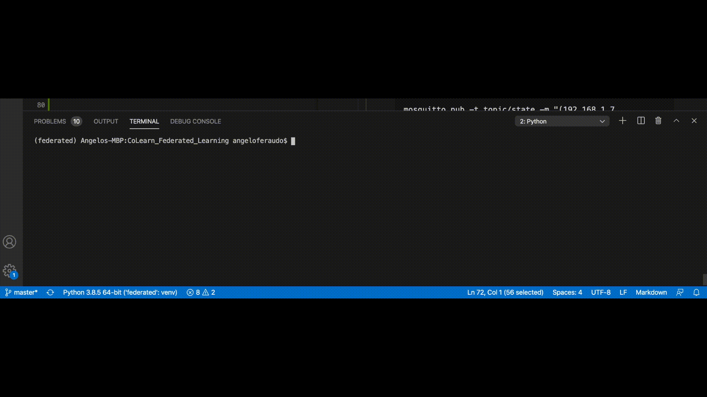

# Federated Learning: distributed architecture for MUD compliant networks

The work has been accepted at EdgeSys 2020 conference.

ACM Reference:

Angelo Feraudo, Poonam Yadav, Vadim Safronov, Diana Andreea Popescu, Richard Mortier, Shiqiang Wang, Paolo Bellavista, and Jon Crowcroft. 2020. **CoLearn: Enabling Federated Learning in MUD-compliant IoT Edge Networks. In 3rd International Workshop on Edge Systems, Analytics and Networking (EdgeSys ’20), April 27, 2020, Heraklion, Greece. ACM, New York, NY, USA, 6 pages. https://doi.org/10.1145/3378679.3394528**. 

Find [PDF](https://github.com/aferaudo/CoLearn_Federated_Learning/tree/master/paper/EdgeSys2020.pdf) and slides [here](https://mega.nz/file/9RZC3Ypb#vBaHJMedH3kVetcrGW2EFxfqdaOZM-kCTmw7yNmch-Y). Please cite the paper as <Feraudo2020> ([bibitex](https://scholar.googleusercontent.com/scholar.bib?q=info:jXK1-vWtZ08J:scholar.google.com/&output=citation&scisdr=CgXTS1sbEMmSirh0F1k:AAGBfm0AAAAAX05xD1nku0EZ-xOA5nTohROoMz9s_rYu&scisig=AAGBfm0AAAAAX05xD8a5ccW6HyVtKmJq3NOEDW3iiOlt&scisf=4&ct=citation&cd=-1&hl=it)).


The architecture provided relies on a pattern publish/subscribe and on the Federated Learning paradigm. Particularly, the technology used is **MQTT**, which is suitable especially for IoT devices. In fact, the aim is to allow IoT devices to signal their training/inference intention and automatically start the operation chosen. In order to enable the Federated Learning (FL) automation a Coordinator, which is able to coordinate all the FL operations, is provided. Thus, an example of interaction between device and Coordinator is:

- the device publishes its training intention;

- the Coordinator (subscriber) receives the status change and wait for other devices (this can be useful to apply some selection criterias across the devices);

- After the waiting time (this term refers to the temporal window) expires, the model is sent to all (or some) devices collected, and the training starts;

- When the training end, the model updates are aggregated by using the Federated Averaging algorithm.

Thus, the most important concepts provided by the architecture are: **publish/subscribe model** for FL operations automation and **temporal winodw** for device collection.

Furthermore, [here](https://github.com/aferaudo/CoLearn_Federated_Learning/tree/master/data) are provided some data that results from experiments conducted on real devices (raspberry pi).

This architecture is designed to work together with MUD so that only **MUD compliant devices** can participate to the Federated Learning protocol.

 
# How to run

## Requirements


### Python requirements
I suggest you to create a python virtual environment before to install all the packages needed.

```bash
virtualenv federated
source federated/bin/activate
```

Now follow the procedure below:
```bash
# Important: do not install the dependencies! We are going to do it by hand
pip install syft==0.2.3a1 --no-dependencies
pip install torch==1.4.0 syft-proto==0.1.1.a1.post2 Flask flask-socketio==3.3.2 lz4==2.1.6 msgpack==0.6.1 numpy phe Pillow==6.2.2 scipy tblib torchvision==0.5.0 websocket-client websockets zstd==1.4.0.0 requests paho-mqtt pandas sklearn psutil
```

**N.B.** PySyft is continuously upgraded, so it's important to use the versioning indicated in the requirements to make everything work.

### Other requirements
Install an MQTT broker (e.g. `mosquitto`) on your machine.

```
e.g. (macos)
brew install mosquitto
/usr/local/sbin/mosquitto
```

If the broker is running on default settings (ip_address==localhost and port==1883), you can avoid to specify the parameters: --host --port of federated_coordinator.py. However, you always need to specify a topic (-t, --topic 'topic/state').

## Run the Coordinator
To have an overview of the options provided by the coordinator, please run

```
python federated_coordinator.py --help
```

### Local testing (VirtualWorker)
The Coordinator has been designed to conduct local testing by exploiting the VirtualWorker concept provided by pysyft.

In order to run the Coordinator in virtual mode, you do not have to specify the `-r` option.
```bash
python federated_coordinator.py -t 'topic/state' -w 1 # Window value can be changed as you want as well as the mqtt topic
```
At the end of the procedure you can notice that a file `test.pth` has been created. In such a file, all model weights are going to be stored.

Now, we need to simulate one or more clients which intend to participate to the federated protocol. For example, you can do that by using the command line:
```
mosquitto_pub -t topic/state -m "(192.168.1.7, TRAINING)"
```




### Remote testing (on the same machine)
In this example we are going to use two workers that could run on two machines different from the one where the coordinator is hosted (paper case).

If you want to run a worker on a raspberry pi 3B+, please follow this [guide](https://github.com/aferaudo/CoLearn_Federated_Learning/tree/master/pytorch-build).

First of all, we need to run the coordinator. As in the local case, we need to specify a topic and a window. Additionally:
```bash
    # -r indicates that we are in the remote case
    # -f <rounds> specifies the number of rounds (default value = 1)
    python federated_coordinator.py -t "topic/state" -w 20 -r -f 10
```
Just to make it more clear, a round includes:
* training of the model received and computation of the model updates;
* sending of the model updates;
* aggregation of the models, Coordinator side, to construct an improved global model.

So, all these operations are repeated `<rounds>` time.

Secondly, we are going to run the two workers (the number is arbitrary). Particularly, in my example I'm going to use the same dataset for both workers.

As always, before to run the worker I strictly recommend to take a look at the brief man provided (`python remote_worker.py -h`)
```bash
# Run this command on a first bash (to replicate the same example you must be in the project directory)
python remote_worker.py --host 127.0.0.1 --port 8585 --broker 127.0.0.1 --topic "topic/state" --training dataset_example/UNSW_2018_IoT_Botnet_Final_10_best_Training_1_1.csv --event TRAINING

# Run this command on a second bash (to replicate the same example you must be in the project directory)
python remote_worker.py --host 127.0.0.1 --port 8586 --broker 127.0.0.1 --topic "topic/state" --training dataset_example/UNSW_2018_IoT_Botnet_Final_10_best_Training_1_1.csv --event TRAINING
```
*Remember to activate the python environment in both terminals.*

The video shows the output that you should have workers (red --> port 8585, green --> port 8586) and coordinator side.


## What do you need to change if you want to use your own model/dataset?
This procedure should be quite straightforward if you already have your pytorch neural network implemented.

What you need to do is:
* add your neural network in the file `client_federated.py`
* create your own `datasets.py` file (its aim is to convert the dataset rows in Tensors)

### Test it
I suggest you to start with [local testing](local-testing-(ViritualWorker)) before to try with the remote one. In this case you need to specify 
in the parameter `test_path` of `Arguments` the path of the csv file containing your dataset. Furthermore, in the method `starting_training_local` some changes are need:

``` python
# Loading of the model
model = cf.FFNN() # Here you need to specify your pytorch model (e.g. cf.MyModel())

...

# This portion of code distribute your dataset among the virtualworkers that request to be trained
# Here you need to specify your dataset adapter (replace NetworkTrafficDataset with YourDataset, which should be located in datasets.py (see previous section))
federated_train_loader = sy.FederatedDataLoader( # <-- this is now a FederatedDataLoader 
                NetworkTrafficDataset(args.test_path, ToTensor())
                .federate(tuple(to_train.values())), # <-- NEW: we distribute the dataset across all the workers, it's now a FederatedDataset
                batch_size=args.batch_size, shuffle=True)

```

### Remote case
The example I'm going to report regards only **training** on remote devices. 

Here we need to act on the `remote_worker.py` file. Particularly, you need to register your dataset with the keyword **training**. So, the lines that you need to change are

```python
# Create your dataset (training) (change NetworkTrafficDataset with your dataset)
dataset = NetworkTrafficDataset(args.training, transform=ToTensor())

# Create your dataset (inference) (change NetworkTrafficDataset with your dataset)
dataset_inf = NetworkTrafficDataset(args.inference, transform=ToTensor())

# You should NOT touch the following lines.

# Register your dataset (training)
worker.add_dataset(dataset, key="training")

# Register your dataset (inference)
inference_tensor = list()

for data in dataset_inf.data:
    inference_tensors.append(th.tensor(data).float().tag("inference"))
worker.load_data(inference_tensors)

```

Now, by following the previous section you should be able to run everything in your environment.

Please drop me an email (you can find it on my website) in case of problems.